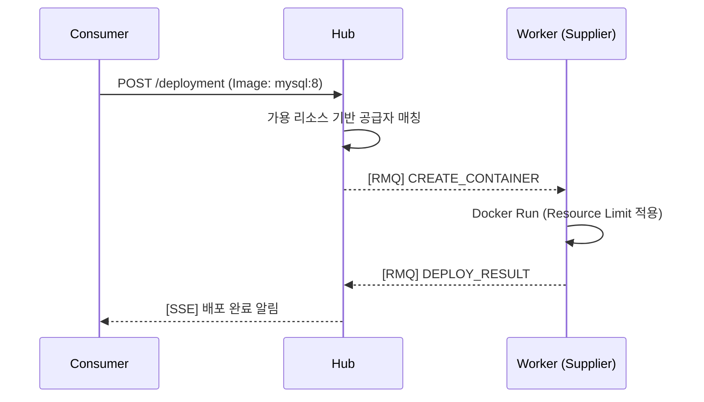
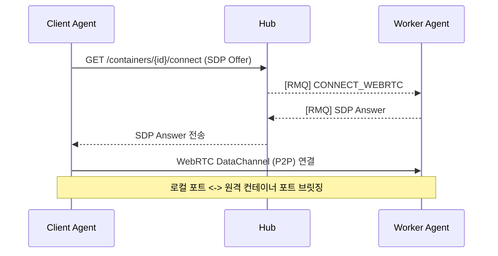

# PeerCaaS — Peer Container as a Service

사용하지 않는 내 컴퓨터의 리소스로 리워드를 얻고, 로컬 리소스가 부족할 때는 남의 리소스에서 무료로 컨테이너를 빌려 쓰는 **P2P 리소스 공유 플랫폼**입니다.

[](https://go.dev/)
[](https://openjdk.org/)
[](https://spring.io/projects/spring-boot)

---

## 1. 서비스 컨셉 (Core Value)

PeerCaaS는 탈중앙화된 컴퓨팅 리소스 공유 생태계를 구축합니다.

- **공급자 (Supplier)**: 본인의 PC나 서버의 남는 CPU/Memory를 제공하여 리워드(Point/Reward)를 획득합니다.
- **사용자 (Consumer)**: 로컬 사양이 부족하거나 무거운 작업을 수행할 때, 다른 사람의 리소스를 빌려 무료로 Docker 컨테이너를 구동합니다.
- **연결 (Tunneling)**: WebRTC P2P 기술을 통해 원격 컨테이너를 마치 내 로컬 포트(`127.0.0.1:3306`)에 띄운 것처럼 투명하게 사용합니다.

---

## 2. 시스템 아키텍처 (System Architecture)

### 2.1. 전체 구성도
```
┌─────────────────────────────────────────────────────────┐
│                Consumer 측 (사용자)                      │
│                                                         │
│   [사용자 앱]  ──TCP──▶  [Client Agent (Go)]            │
│                            │       ▲                    │
│                            │ WebRTC│ or TCP Relay       │
└────────────────────────────┼───────┼────────────────────┘
                             │       │
                    ┌────────▼───────┴────────┐
                    │      platform/hub        │  ← REST / SSE
                    │    (Spring Boot :8080)   │  ← RabbitMQ
                    │                         │
                    │  - 리소스 매칭/정산 관리     │
                    │  - WebRTC 시그널링        │
                    │  - Relay 세션 조율        │
                    └──────┬──────────────────┘
                           │
              ┌────────────┴────────────┐
              │                         │
   ┌──────────▼──────────┐   ┌──────────▼──────────┐
   │   platform/engine    │   │   RabbitMQ           │
   │  (Spring Boot :8090) │   │                      │
   │                      │   │  - worker queue      │
   │  - TCP Relay 서버    │   │  - reply queue       │
   │    (:6006)           │   └──────────┬───────────┘
   └──────────────────────┘              │
                                ┌────────▼────────────┐
                                │  Worker Agent (Go)   │
                                │   (Supplier - 공급자)  │
                                │                      │
                                │  - Docker 컨테이너 호스팅│
                                │  - 리소스/정산 메트릭 보고│
                                │  - WebRTC/Relay 연결   │
                                └──────────────────────┘
```

### 2.2. 신뢰성 있는 리워드 정산 (Metrics & Reward Reliability)
공급자가 제공한 리소스(CPU, Mem, Traffic)가 유실 없이 정산됨을 보장하는 메커니즘입니다.

```
[ Supplier Node (Worker Agent) ]
┌───────────────────────────────────────────────────────────┐
│  [ Docker SDK ]  ──(1) Usage Stat──▶ [ Metric Collector ]  │
│                                              │            │
│  [ Local Storage ] ◀──(2) Persistence ── [ SQLite (WAL) ] │
│        (유실 방지)                            │            │
│  [ VM Shipper ]  ◀──(3) Ship 1m Batch ───────┘            │
└────────┬──────────────────────────────────────────────────┘
         │
         ▼ (4) At-Least-Once Delivery (HTTPS Auth)
┌───────────────────────────────────────────────────────────┐
│                [ PeerCaaS Central System ]                │
│                                                           │
│  [ VictoriaMetrics ] ──(5) Aggregation ──▶ [ Hub / Reward ]│
│    (고성능 TSDB)                            (포인트/정산)   │
└───────────────────────────────────────────────────────────┘
```

---

## 3. 핵심 설계 결정 (Why PeerCaaS?)

### 3.1. 탈중앙화된 리소스 수집 (Why Decentralized?)
- 특정 데이터센터에 의존하지 않고 전 세계 사용자의 유휴 자원을 활용하여 비용을 최소화합니다.
- **Decision**: 가볍고 설치가 간편한 **Go 기반 에이전트**를 배포하여 누구나 쉽게 공급자가 될 수 있게 설계했습니다.

### 3.2. 신뢰할 수 있는 리워드 정산 (Why SQLite WAL?)
- 공급자가 제공한 리소스 양에 따라 정확한 리워드가 지급되어야 합니다.
- **Decision**: 네트워크 장애 시에도 메트릭이 유실되지 않도록 **로컬 SQLite에 먼저 기록**하고, 중앙 서버(VictoriaMetrics)로 성공적으로 전송될 때까지 보관하는 `At-Least-Once` 전송 전략을 구현했습니다.

### 3.3. 투명한 네트워크 사용 (Why WebRTC?)
- VPN이나 복잡한 포트 포워딩 없이 원격 리소스에 즉시 연결되어야 합니다.
- **Decision**: **Pion WebRTC**를 사용하여 P2P 터널을 뚫고, 방화벽 환경에서는 자동으로 **TCP Relay**로 전환되는 하이브리드 연결 방식을 채택했습니다.

---

## 4. 아키텍처 플로우 (Architecture Flow)

### 4.1. 컨테이너 배포 및 리소스 매칭


### 4.2. WebRTC 터널 연결 (P2P)


---

## 5. 상세 기술 스택 (Tech Stack)

| 구분 | 기술 | 상세 |
|:---:|:---|:---|
| **Hub** | Java 21, Spring Boot 3.4 | 리소스 매칭, 시그널링, 리워드 정산 로직 |
| **Engine** | Java 21, Spring Boot 3.4 | TCP 랑데부 릴레이 서버 |
| **Worker Agent** | Go 1.23+, Docker SDK | 공급자용 리소스 모니터링 및 컨테이너 호스팅 |
| **Client Agent** | Go 1.23+, Pion WebRTC | 사용자용 터널링 및 커넥션 매니저 |
| **Monitoring** | SQLite, VictoriaMetrics | At-Least-Once 메트릭 수집 및 시계열 분석 |

---

## 6. 프로젝트 구조 (Directory Structure)

```text
peercaas/
├── platform/               # JVM 기반 컨트롤/릴레이 플레인
│   ├── hub/                # [Control] 리소스 매칭, 시그널링, 정산(Reward) 로직
│   └── engine/             # [Relay] TCP 릴레이 세션 조율 서버
├── agents/                 # Go 기반 데이터 플레인
│   ├── cmd/worker/         # [Supplier] 공급자용 에이전트 진입점
│   ├── cmd/client/         # [Consumer] 사용자용 에이전트 진입점
│   └── internal/
│       ├── metrics/        # 리워드 계산을 위한 SQLite 영속 수집기
│       └── app/            # 터널링 및 컨테이너 제어 핸들러
```

---

## 7. 코드 딥다이브 (Deep Dive)

- **[Reward Metric Persistence]**: `agents/internal/metrics/reporter.go` - 리워드 유실 방지를 위한 SQLite-first 로직.
- **[Connection Hotswap]**: `agents/internal/app/client/connection_manager.go` - WebRTC/Relay 자동 전환 및 재연결 전략.
- **[Worker Resource Limit]**: `agents/internal/app/worker/heartbeat.go` - 공급자 유휴 자원 측정 및 정기 보고.

*Last Updated: 2026-03-02 (AI & Business Optimized)*
