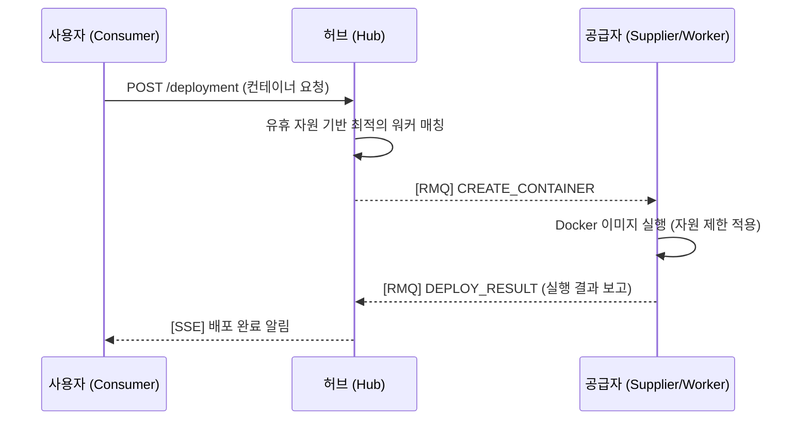
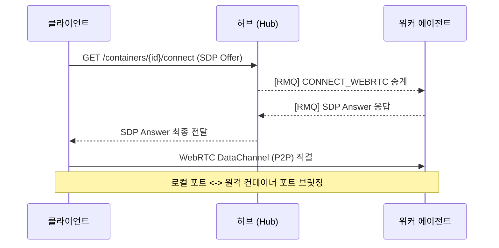

# PeerCaaS — Peer Container as a Service

사용하지 않는 내 컴퓨터의 리소스로 리워드를 얻고, 로컬 리소스가 부족할 때는 다른 사용자의 리소스를 빌려 무료로 컨테이너를 실행하는 **P2P 리소스 공유 플랫폼**입니다.

[](https://go.dev/)
[](https://openjdk.org/)
[](https://spring.io/projects/spring-boot)

---

## 1. 서비스 가치 (Core Value)

PeerCaaS는 모두가 참여하는 탈중앙화 컴퓨팅 생태계를 지향합니다.

- **공급자 (Supplier)**: PC나 서버의 남는 자원(CPU, 메모리, 트래픽)을 공유하고 포인트/리워드를 적립합니다.
- **사용자 (Consumer)**: 무거운 로컬 작업을 대신할 원격 컨테이너를 무료로 사용하며 로컬 리소스를 최적화합니다.
- **연결 (Tunneling)**: WebRTC P2P를 통해 멀리 떨어진 컨테이너를 `127.0.0.1:3306`과 같이 내 컴퓨터 포트처럼 즉시 연결합니다.

---

## 2. 시스템 아키텍처 (System Architecture)

### 2.1. 전체 구성도
```
┌─────────────────────────────────────────────────────────┐
│                사용자 측 (Consumer)                      │
│                                                         │
│   [사용자 앱]  ──TCP──▶  [클라이언트 에이전트 (Go)]       │
│                            │       ▲                    │
│                            │ WebRTC│ 또는 TCP 릴레이      │
└────────────────────────────┼───────┼────────────────────┘
                             │       │
                    ┌────────▼───────┴────────┐
                    │      platform/hub        │  ← REST / SSE
                    │    (Spring Boot :8080)   │  ← RabbitMQ
                    │                         │
                    │  - 리소스 매칭 및 정산 관리   │
                    │  - WebRTC 시그널링 중계     │
                    │  - 릴레이 세션 조율         │
                    └──────┬──────────────────┘
                           │
              ┌────────────┴────────────┐
              │                         │
   ┌──────────▼──────────┐   ┌──────────▼──────────┐
   │   platform/engine    │   │   RabbitMQ           │
   │  (Spring Boot :8090) │   │                      │
   │                      │   │  - 워커 큐 (Worker)   │
   │  - TCP 릴레이 서버    │   │  - 응답 큐 (Reply)    │
   │    (:6006)           │   └──────────┬───────────┘
   └──────────────────────┘              │
                                ┌────────▼────────────┐
                                │   워커 에이전트 (Go)   │
                                │   (공급자 - Supplier)   │
                                │                      │
                                │  - 컨테이너 호스팅/제어  │
                                │  - 사용량/정산 메트릭 보고│
                                │  - WebRTC 및 릴레이 연결 │
                                └──────────────────────┘
```

### 2.2. 정산의 신뢰성 (Reward Reliability)
공급자가 제공한 리소스에 대해 정당한 보상을 받을 수 있도록 보장하는 메커니즘입니다.

```
[ 공급자 노드 (워커 에이전트) ]
┌───────────────────────────────────────────────────────────┐
│  [ Docker SDK ]  ──(1) 사용량 수집──▶ [ 메트릭 수집기 ]      │
│                                              │            │
│  [ 로컬 저장소 ] ◀──(2) 영속화 (WAL) ── [ SQLite ]         │
│     (유실 방지)                               │            │
│  [ 전송기 (Shipper) ] ◀──(3) 1분 단위 배치 ────┘            │
└────────┬──────────────────────────────────────────────────┘
         │
         ▼ (4) At-Least-Once 전송 보장 (성공 시까지 재시도)
┌───────────────────────────────────────────────────────────┐
│                [ PeerCaaS 중앙 시스템 ]                     │
│                                                           │
│  [ VictoriaMetrics ] ──(5) 데이터 집계 ──▶ [ 허브 / 정산 ]   │
│     (고성능 TSDB)                           (포인트 지급)   │
└───────────────────────────────────────────────────────────┘
```

---

## 3. 핵심 설계 결정 (왜 이렇게 만들었나요?)

### 3.1. 탈중앙화 리소스 (Decentralized)
- 고가의 데이터센터 대신 전 세계 유휴 자원을 활용하여 서비스 비용을 파격적으로 낮춥니다.
- **결정**: 가볍고 설치가 쉬운 **Go 에이전트**를 통해 누구나 쉽게 공급자가 될 수 있게 했습니다.

### 3.2. 정산 신뢰성 (SQLite WAL)
- 공급자의 보상은 1원이라도 누락되어서는 안 됩니다.
- **결정**: 네트워크 불안정 시에도 메트릭이 유실되지 않도록 **로컬 SQLite에 먼저 기록**하고, 전송 성공을 확인할 때까지 유지하는 `At-Least-Once` 전략을 채택했습니다.

### 3.3. 하이브리드 연결 (WebRTC & Relay)
- 어떤 네트워크 환경에서도 터널이 뚫려야 합니다.
- **결정**: **Pion WebRTC**로 P2P 연결을 시도하고, 실패 시 랑데부 방식의 **TCP 릴레이** 서버로 자동 전환하여 끊김 없는 사용성을 제공합니다.

---

## 4. 상세 워크플로우 (Flow)

### 4.1. 컨테이너 배포 및 매칭


### 4.2. WebRTC P2P 터널 연결


---

## 5. 프로젝트 구조

```text
peercaas/
├── platform/               # JVM 기반 제어 및 릴레이 서버
│   ├── hub/                # [Control] 리소스 매칭, 시그널링, 정산(리워드)
│   └── engine/             # [Relay] TCP 릴레이 세션 조율
├── agents/                 # Go 기반 데이터 에이전트
│   ├── cmd/worker/         # [공급자용] 리소스 제공 및 메트릭 수집
│   ├── cmd/client/         # [사용자용] 터널링 및 컨테이너 접속
│   └── internal/
│       ├── metrics/        # 보상 계산을 위한 SQLite 영속 수집기
│       └── app/            # 터널링 및 Docker 제어 핸들러
```

---

## 6. 코드 딥다이브 (Deep Dive)

- **[리워드 메트릭 영속화]**: `agents/internal/metrics/reporter.go` - 보상 유실 방지 로직.
- **[연결 핫스왑]**: `agents/internal/app/client/connection_manager.go` - WebRTC/릴레이 자동 전환 전략.
- **[공급자 자원 측정]**: `agents/internal/app/worker/heartbeat.go` - 유휴 자원 실시간 보고 시스템.

*마지막 업데이트: 2026-03-02 (비즈니스 및 AI 최적화)*
